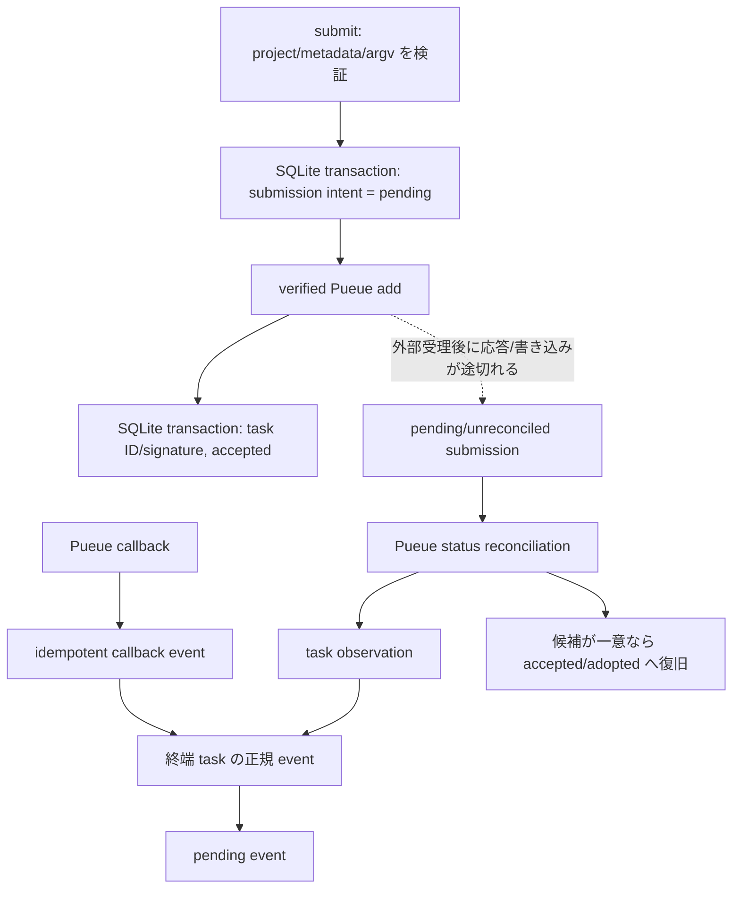
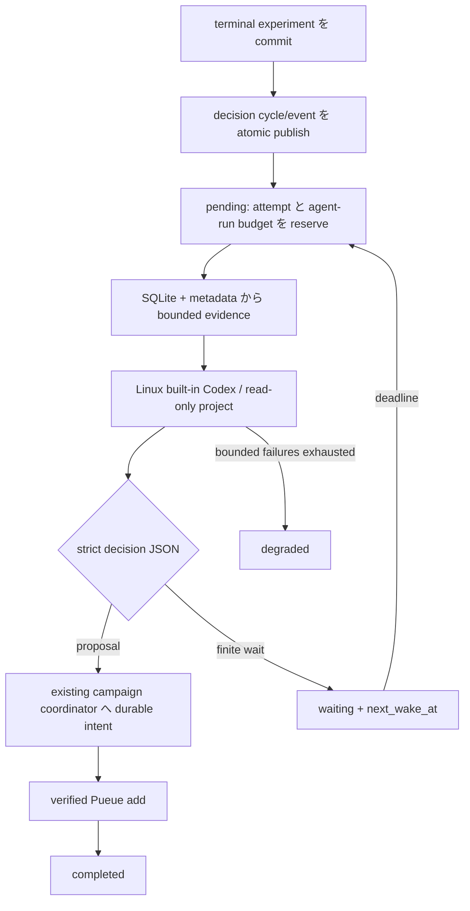
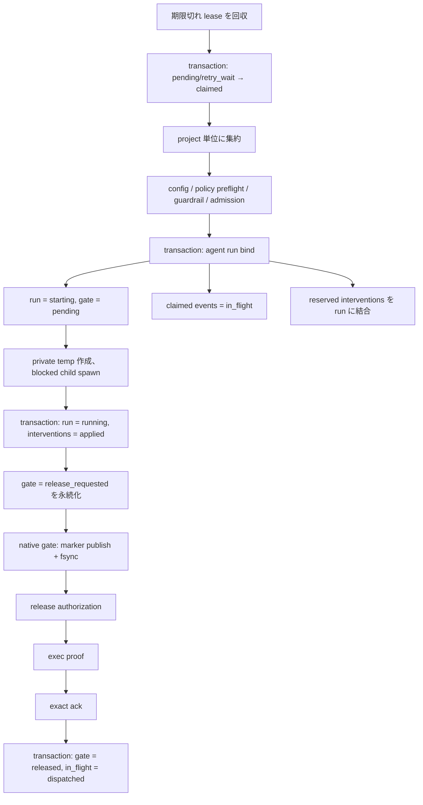
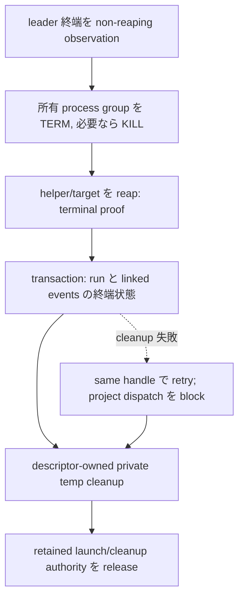
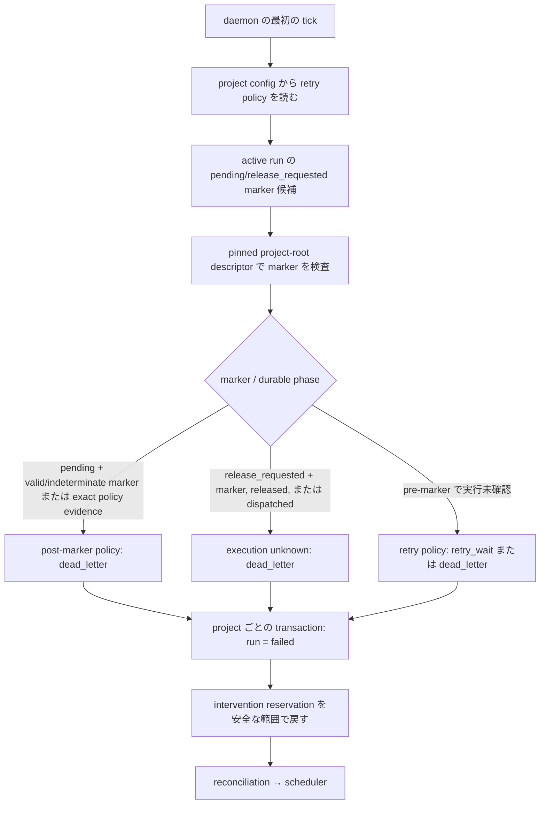

# 内部アーキテクチャ

`pueue-agent` は、Pueue の task 実行と coding agent の判断を分離し、SQLite に永続化した event があるときだけ agent を起動する supervisor です。この文書は、現在の Rust 実装における責務、transaction 順序、native launch の authorization 境界、および再起動復旧を開発者向けにまとめます。

## コンポーネント

| コンポーネント | 所有する責務 | 所有しないもの | 主な実装 |
| --- | --- | --- | --- |
| submit 経路 | project と argv の検証、submission intent の先行永続化、Pueue add 結果の記録 | Pueue の task 実行 | [`submit.rs`](../src/submit.rs), [`pueue.rs`](../src/pueue.rs) |
| campaign coordinator | 最初の submit と accepted decision proposal を durable intent に変換し、commit 後の Pueue add と accepted/unreconciled 遷移を調停 | decision evidence の構築や agent 実行 | [`campaign.rs`](../src/campaign.rs), [`db/campaigns.rs`](../src/db/campaigns.rs) |
| decision coordinator | terminal experiment の decision cycle、bounded evidence、read-only analysis、proposal/finite wait の適用と再起動復旧 | running health/OOM の継続観測、code change | [`decision.rs`](../src/decision.rs), [`decision_evidence.rs`](../src/decision_evidence.rs), [`db/decisions.rs`](../src/db/decisions.rs) |
| Pueue adapter | 許可済み operation の argv 組み立て、検証済み Pueue/config の利用、timeout と stdout/stderr 上限 | event の永続化や retry 判定 | [`pueue.rs`](../src/pueue.rs), [`pueue_process.rs`](../src/pueue_process.rs) |
| callback / reconciliation | callback の idempotent 取り込み、Pueue status の観測、terminal event の正規化、submission の突合 | agent dispatch | [`events.rs`](../src/events.rs), [`reconcile.rs`](../src/reconcile.rs) |
| repository 層 | SQLite の制約、lease、状態遷移、run/event 結合、終端処理の transaction | OS process の生死 | [`db/repositories.rs`](../src/db/repositories.rs), [`models.rs`](../src/models.rs) |
| scheduler | lease 回収、event claim、project 単位の集約、guardrail、policy preflight、agent run bind | child の実行許可と終端 proof | [`scheduler.rs`](../src/scheduler.rs) |
| agent runner / handle | private temp と launch authority の保持、run の起動順序、timeout、終端状態の永続化、cleanup retry | Pueue task の kill | [`agent.rs`](../src/agent.rs) |
| native launcher | project-root descriptor 相対の log/marker、marker の永続化後の release | event や retry policy | [`native_launcher.rs`](../src/native_launcher.rs), [`project_logs.rs`](../src/project_logs.rs) |
| process core | fixed descriptor ABI、bounded control frame、ヘルパー、blocked target、exec proof、exact ack、process-group 所有 | marker を作るかどうかの上位判断 | [`process.rs`](../src/process.rs) |
| environment / private temp | 既定拒否の child environment、run ごとの directory capability、descriptor-relative な inventory/cleanup | 隠した環境変数の自動継承 | [`environment.rs`](../src/environment.rs) |
| daemon | startup/decision recovery、reconciliation、persisted decision 適用、due wake、scheduler の tick 順序、所有 handle の poll/drain | Pueue daemon 自体の lifecycle | [`daemon.rs`](../src/daemon.rs) |

## 所有する状態と設定

| 情報 | source of truth | 主な読み手 |
| --- | --- | --- |
| project 登録、submission、event、task observation、incident、termination request、intervention、agent run | service state directory の SQLite `state.sqlite3` | repository 層のみが状態遷移を書き込む。運用時に直接 SQL で編集しない |
| agent、check、guardrail、Pueue group | project の `.pueue-agent/config.toml` | submit と daemon startup recovery は DB 登録の project ID/group と一致を検証する |
| campaign、immutable objective snapshot、proposal、experiment、rolling budget reservation、submission/task lineage | service state directory の SQLite `state.sqlite3` | repository と coordinator が transaction 内で状態遷移する |
| decision cycle、attempt、bounded context/output digest、finite wake | service state directory の SQLite `state.sqlite3` | decision repository/coordinator だけが遷移し、raw payload は status/doctor に投影しない |
| current/historical facts、active lineage の bounded scratch projection | `.pueue-agent/state.json` | agent の補助 context。objective/budget/lineage の authority にはしない |
| 人間が定める campaign objective と制約 | `.pueue-agent/STATE.md` | 最初の submit で bounded snapshot 化する。active campaign 中の編集で SQLite objective を上書きしない |
| 起動時の executable、trusted path、Pueue config、network/environment policy | service state directory の `execution-policy.toml` を検証して作る immutable anchor/capability | daemon 起動後は ambient `PATH` で実行ファイルを再解決せず、使用直前に identity を再検証する |
| agent log、authorization marker、private temp generation | project root からの descriptor-relative な `.pueue-agent/` 配下 | SQLite の絶対パスは相対名との一致検証用であり、startup recovery でそのパスを直接 reopen しない |

SQLite は durable lifecycle の source of truth ですが、「process が実際に動いたか」の proof そのものではありません。その境界は launch marker、exec-status pipe、release ack、および所有する child/process group の観測で補います。

## Submission から event まで

managed baseline の外部副作用境界は、(1) 一つの immediate transaction で campaign、baseline proposal、experiment、budget reservation、submission intent を commit、(2) verified Pueue add、(3) 別の transaction で accepted task ID/signature を保存、という順序です。reserved は再起動後も一度だけ add を再開できますが、外部 add を開始済みの submitting は `unreconciled` に隔離し、自動再 add しません。

submit は、native control frame に収まらない argv を永続化前に拒否します。検証後の順序は、(1) `pending` submission intent を immediate transaction で commit、(2) 外部の `pueue add`、(3) 返却された task ID と provisional signature を別 transaction で `accepted` として commit、です。SQLite と Pueue を跨ぐ transaction はないため、この間の中断は意図的に reconciliation の対象です。

Phase 2 の daemon recovery は stale `submitting` を `unreconciled` へ進め、`unreconciled` と `accepted` を再 add せず、`reserved` だけを durable argv/working directory から再開します。rolling budget は有限の `next_eligible_at` を持ち、window expiry 後に `active` へ戻します。加えて terminal experiment の decision state を復旧し、persisted decision を再検証してから existing coordinator へ適用します。

## Terminal completion decision loop

一意に reconciliation された terminal experiment は、同じ transaction で lineage-exact な `campaign_decision` event と一つの `decision cycle` を作ります。cycle state は `pending`、`analyzing`、`waiting`、`completed`、`degraded` です。campaign では active attempt と decision AgentRun を同時に一つだけ許可します。

decision runner は startup-pinned built-in Codex だけを使い、project root を read-only、verified private temp を唯一の output capability とします。network は service policy に従いますが credential/auth environment は除外します。context JSON と decision JSON は各 128 KiB 以下で、output は schema 検証と digest 照合の後にだけ永続化されます。decision agent 自身は Pueue を呼ばず、source を編集しません。

proposal は supervisor-owned ID と idempotency key で既存 coordinator に渡され、SQLite の accepted intent が外部 add より先です。finite wait は Pueue task を作らず、service-owned 上限内の絶対 `next_wake_at` だけを保存します。analysis は hourly agent-run budget、proposal は rolling experiment budget を消費します。連続失敗が `max_decision_attempts_per_cycle` に達すると cycle/campaign は `degraded` になり、自動 replay しません。

Phase 3 の `running OOM/stall observer`、実行中 experiment の `periodic observer` による campaign health-decision loop、`goal review`、`code worktree` はこの terminal loop に含まれません。

service policy の network default は `enabled` ですが、sanitized environment は別の allowlist 境界です。network を利用可能にしても、allowlist 外の credential/environment value を agent または agent task に継承しません。

reconciliation は Pueue status を正常に取得してから observation を書きます。status の取得失敗を「空のキュー」と扱いません。terminal task は lifecycle 情報と result を含む dedup key で `task_finished` / `task_failed` / `auto_killed` event に正規化されます。callback event が先にある場合は、重複を増やすのではなく terminal event で置き換え、または重複した pending callback を捨てます。

Pueue 側の task と submission の突合は、project group、task ID が既にあればその一致、canonical command display、および enqueue 時刻の有界な近さを使います。候補が正確に 1 件のときだけ `accepted` または `adopted` にし、曖昧な場合は自動採用しません。

## Scheduler と agent dispatch

dispatch の中心は、次の順序を崩さないことです。

1. Scheduler は、active project かつ active run がない event を lease 付きで `claimed` にします。claim は immediate transaction です。
2. config、immutable execution policy、prompt/argv の表現上限、guardrail、run-ID/private-temp 容量を policy preflight します。policy violation は run を作らず、claim した event 全体を transaction で `dead_letter` にします。
3. agent run bind transaction は、`starting` run の insert、`agent_run_events` の結合、event の `claimed` → `in_flight`、および intervention reservation の run への結合を一括 commit します。部分的な bind は残しません。
4. native target は blocked/suspended な状態で作られます。PID を得た後、run の `running` 化と reserved intervention の `applied` 化を transaction で commit し、続けて gate を `release_requested` とします。この時点で event はまだ `in_flight` です。
5. private temp、project root、executable、log descriptor を再検証し、authorization marker を排他的に作成して file と parent directory を sync します。その後だけ release byte を送ります。
6. parent は close-on-exec の EOF による exec proof を確認し、その後に固定値 `released\n` と完全一致する exact ack を読みます。
7. 最後の dispatch acknowledgement transaction は、gate が `release_requested`、結合 event がすべて `in_flight` であることを再検証し、gate を `released`、event を `dispatched` に同時変更します。

marker 前の一時的失敗は retry policy に従えます。policy violation または marker 後の実行不明は、同じ event を再実行しないよう `dead_letter` にします。marker 後の失敗では applied intervention も「未配送」に戻しません。

## Native launch gate

native gate は、永続化した dispatch 意図と target code の実行開始をつなぐ、descriptor/capability ベースの境界です。supervisor は検証済み launcher を hidden subcommand だけの argv で起動し、target argv/environment と identity は最大 1 MiB の length-delimited control frame と SCM_RIGHTS で渡します。frame は target を作る前に全体を検証します。

| fd | 能力 | target への扱い |
| --- | --- | --- |
| 3 | control frame | helper の受信用。target へ継承しない |
| 4 | release authorization | marker 永続化後の 1 byte 許可。EOF/不一致は実行拒否 |
| 5 | exec status | exec 失敗は固定 record、成功は close-on-exec EOF で proof |
| 6 | verified target executable | Linux では `execveat(..., AT_EMPTY_PATH)` に使う |
| 7 | verified project root | agent mode の cwd と descriptor-relative な project 所有権に使う |
| 8 | verified agent log | stdout/stderr は同じ検証済み inode の clone へ送る |
| 9 | verified Pueue config | Pueue target にだけ `/dev/fd/9` として明示継承 |
| 10 | release ack | target の exec 確認後に helper が exact ack を返す |
| 11 | verified private temp | agent target にだけ継承し、`TMPDIR` / `TMP` / `TEMP` は `/dev/fd/11` を指す |

fixed FD は helper ABI であり、control frame 側から任意の inherited descriptor を選べません。不要な能力は close-on-exec で閉じ、Pueue config と private temp のように target が必要とする descriptor だけを mode ごとに明示的に継承します。

Linux は検証済み executable FD を使う blocked fork + `execveat` です。macOS は target path/identity を検証し、`POSIX_SPAWN_START_SUSPENDED` で作成し、再検証後に `SIGCONT` します。どちらも helper が session/process-group leader であることを必須とし、release 前に失敗すれば blocked target を cancel/reap します。

## Agent 終了と private temp cleanup

agent の正常終了と非 0 終了は、leader の terminal observation だけで即座に DB へ書かれるわけではありません。所有する process group を drain し、leader を reap した後に、run と結合 event を同じ immediate transaction で終端化します。timeout と daemon shutdown は先に group termination/reap を実行し、その後 `timed_out` を永続化します。

終端 transaction は、run 状態、exit code/error の有界な投影、および結合 event の `completed` / `retry_wait` / `dead_letter` を一括で書きます。この commit 後にのみ private temp 内容を cleanup し、最後に executable/project/private-temp の retained authority を解放します。cleanup が失敗したら terminal 永続化を巻き戻さず、同じ handle/capability を保持して retry します。その間、対象 project の新規 dispatch は停止します。

private temp cleanup は保持中の directory descriptor から行い、owner/mode/inode と mount 境界を再検証し、深さ、entry 数、allocated bytes の上限内で監査した内容だけを削除します。run-ID の generation directory 自体は空のまま保持します。pathname のすり替えがあっても別 generation を削除しないことを優先します。

`ECHILD` は「leader の所有を失った」ことしか証明しません。group が drain 済みとは扱わず、run の終端永続化や未検証 signal を行わないまま、同じ handle と cleanup authority を unresolved として保持します。

## 状態モデル

### Event states

| DB/JSON 値 | 意味 | 主な次状態 |
| --- | --- | --- |
| `pending` | 未 claim。`not_before` 以降に active project で対象になる | `claimed` |
| `claimed` | lease 付きで scheduler が一時所有。run へは未結合 | `in_flight`、`pending`、`retry_wait`、`failed`、`dead_letter` |
| `in_flight` | agent run bind transaction 済み。native dispatch ack 前 | `dispatched`、`retry_wait`、`dead_letter` |
| `dispatched` | marker、release、exec proof、exact ack を確認し、dispatch acknowledgement 済み | `completed`、`retry_wait`、`dead_letter` |
| `completed` | agent run が成功し、終端 transaction 済み | 終端状態 |
| `retry_wait` | retry policy による次回時刻待ち | `claimed` |
| `failed` | run を作る前の project/config/guardrail 等の終端失敗 | 終端状態 |
| `dead_letter` | retry 上限、policy block、または実行結果不明のため自動再実行しない | 終端状態 |

`claimed` の期限切れ回収は、run に結合されていない event だけを `pending` へ戻し、claim で増やした attempts を 1 減らします。結合済み event は startup recovery または run finalizer の所有です。

### Agent-run states

| DB/JSON 値 | 意味 |
| --- | --- |
| `starting` | event と run の atomic bind 済みで、PID はまだ永続化されていない |
| `running` | blocked child の PID と intervention application を永続化済み。gate が未 release の時間も含む |
| `completed` | exit success の terminal proof 後に run/event transaction を commit 済み |
| `failed` | 非 0 終了、起動/finalization 失敗、または startup recovery で終端化 |
| `timed_out` | 所有 process group の termination/reap 後に timeout を永続化 |
| `cancelled` | repository が受け入れる終端状態。現行の daemon timeout 経路は `timed_out` を使う |

### Launch-gate states

| DB 値 | 意味 |
| --- | --- |
| `pending` | run bind 時の初期値。blocked child が存在していても release 要求は未永続化 |
| `release_requested` | PID/running の永続化後、marker と release protocol に入る意図を永続化済み |
| `released` | exact ack 後の acknowledgement transaction 済み、または startup recovery が execution unknown と保守的に固定 |
| `failed` | release 前の失敗または pending marker policy failure を終端化 |

launch-gate state は OS process state の別名ではありません。例えば run が `running` でも gate は `pending` であり得ます。

### コマンドの停止境界

| 操作 | 直接の対象 | Pueue task | agent run | project 状態 |
| --- | --- | --- | --- | --- |
| `pause` | project の自律 dispatch | 継続 | 実行中は継続 | `paused=true` |
| `resume` | project の自律 dispatch | 継続 | 新規 dispatch を再開 | pause/halt を解除 |
| `stop` | supervisor user service | 継続し、kill しない | daemon shutdown policy で grace 付き drain | 変更なし |
| `start` | supervisor user service | 継続 | active project の新規 dispatch を再開 | 変更なし |
| `cancel --task-id ID` | 同じ project group の指定 task | queued は remove、running は kill を対象 task だけに要求 | 直接停止・変更しない | 継続 |
| `disable` | project の自動運用登録 | 継続 | 新規起動なし | `enabled=false`、group 予約は維持 |
| `disable --remove` | project 登録と group 予約 | 継続 | 新規起動なし | 登録解除 |

`stop`、`pause`、`disable` は Pueue task 停止の代替ではありません。task を止める操作は、所有権と stale status を再検証する `cancel --task-id ID` です。`cancel` は operator log を記録し、停止を確認できない場合にだけ `termination_failed` event を作成します。

## Daemon startup recovery

startup recovery は、通常の reconciliation や新規 claim より先に 1 回だけ実行します。保存された log path は、「project root + production 形式の相対 log 名」と完全一致するかを検証するためにだけ使います。marker 自体は検証済み project-root descriptor から読み、保存絶対パスを reopen しません。検査結果は valid、absent、または secure parent は確認できたが final entry が不定な indeterminate です。

active run と linked event は project ごとの immediate transaction で回収します。marker 前で実行が確認できない `in_flight` event は retry policy で `retry_wait` または `dead_letter` にします。`pending` gate の valid/indeterminate marker または既に永続化された exact policy evidence は post-marker policy failure として `dead_letter` にします。`release_requested` gate の marker、`released` gate、または `dispatched` event は target 実行を否定できないため execution unknown として `dead_letter` にします。すべての active run は `failed` に終端化します。

この復旧は保存 PID だけを使って process に signal したり、新しい daemon が旧 process の所有権を再構成したりするものではありません。永続状態と marker evidence から、重複実行を避ける側に分類する復旧です。

## 診断と redaction

診断は、運用上必要な ID、状態、時刻、policy code/stage、有界な execution audit facts を表示する一方、実行入力の展開を避けます。agent-run の診断投影は execution kind、絶対 executable path、identity に限定し、prompt、argv、environment、credential、log output を含めません。Pueue task の command は実行ファイル名の安全な要約だけを表示し、shell wrapper、environment assignment、不正な token は `unknown` とします。

現在の decision status は cycle を最大1件だけ投影し、`cycle_id`、`source_experiment_id`、`state`、`attempt_count`、`last_decision_kind`、`next_wake_at`、bounded failure code/summary を含みます。doctor は project/campaign scoped の indexed query で lineage、single-owner attempt/binding、overdue run、finite wake、digest、degraded diagnostics を読み取り専用で検査します。malformed row は typed error check であり、migration/repair を起こしません。context/decision JSON、digest 自体、prompt、transcript、environment、完全な argv、log excerpt、raw objective はどちらにも出しません。

user-facing な error/reason は control/ANSI 文字を除去し、パス、credential 形式、機密に見える token を redaction して 240 bytes に制限します。native control frame の `Debug` は argv/environment の個数だけ、sanitized environment の `Debug` は変数名だけを出します。Pueue の captured stdout/stderr は上限付きで回収しますが、error の `Debug` は内容ではなく byte 数を出します。

ただし、redaction は access control の代わりではありません。submission の argv、Pueue observation/event payload、agent log など、実行と監査に必要な情報を所有する保存先には、service/project の filesystem 権限が必要です。

## セキュリティ境界

- **Immutable policy boundary:** executable は startup で canonical path、device/inode、owner、mode を anchor 化し、launch 直前も identity を再検証します。custom agent は policy の allowlist への明示登録が必要です。
- **Environment boundary:** child の inherited environment は一度 clear し、固定 baseline、生成値、および agent 種別ごとの allowlist だけを再構成します。汎用 allowlist は auth/proxy/certificate 名を通さず、Codex 認証値は built-in Codex agent にだけ明示的に渡します。
- **Descriptor boundary:** project root、agent log、Pueue config、private temp は検証済み descriptor/capability と identity で渡し、検証後の ambient path lookup を減らします。symlink、所有者/mode 違反、identity 変化、mount 境界の不明は fail closed です。
- **Durable authorization boundary:** marker は owner-only の新規 file として排他作成し、file と parent を sync します。この layer は marker を削除も置換もしません。marker なしの release は protocol 上拒否されます。
- **Database boundary:** event claim、run bind、dispatch acknowledgement、terminal finalization、startup recovery は、それぞれ検証と書き込みを immediate transaction に閉じます。external Pueue call と SQLite の間だけは単一 transaction ではなく、submission intent + reconciliation で補償します。
- **Process ownership boundary:** helper が session/process-group leader となり、親は unreaped leader によって PGID の再利用を防ぎながら、group へ TERM/KILL を送って reap します。一方で、**PGID はすべての子孫 process を完全に containment する境界ではありません**。別 session/group へ離脱した process の包括や、container/cgroup/seccomp/macOS sandbox による強制隔離は実装範囲外です。
- **Stop boundary:** service、自律 dispatch、agent run、Pueue task は別の lifecycle です。service stop や project pause/disable から Pueue task kill を推論しません。

## プラットフォーム対応

- Linux: Ubuntu GitHub Actions で debug check、release check、全ターゲットの serial test、shell syntax を検証済み。private temp の mount 境界確認には kernel 5.8 以降を要求する。
- macOS: launchd 経路は存在するが、private temp を `/dev/fd/11` の子パスとして利用できない既知制約があるため、Linux と同等の agent 実行対応を主張しない。
- その他: fail closed とし、対応済みとは記載しない。

Linux private temp の mount 境界検証は `openat2(RESOLVE_NO_XDEV)` と `statx` mount ID に依存します。必要な kernel 機能を確認できない場合は、device ID だけの弱い判定へ fallback せず `unsupported_platform` で起動/cleanup を拒否します。

## コードを追うための入口

- Submission intent と Pueue add の順序: [`submit::run_with_options`](../src/submit.rs)
- Pueue operation の安全な argv と adapter: [`pueue.rs`](../src/pueue.rs)
- bounded Pueue process と cleanup: [`pueue_process.rs`](../src/pueue_process.rs)
- callback の idempotency: [`events.rs`](../src/events.rs)
- status reconciliation、terminal event、submission recovery: [`reconcile.rs`](../src/reconcile.rs)
- terminal decision evidence、適用、復旧: [`decision_evidence.rs`](../src/decision_evidence.rs), [`decision.rs`](../src/decision.rs), [`db/decisions.rs`](../src/db/decisions.rs)
- claim、policy preflight、project 単位 dispatch: [`scheduler.rs`](../src/scheduler.rs)
- agent run bind 後の起動と terminal/private-temp 順序: [`agent.rs`](../src/agent.rs)
- marker/release adapter: [`native_launcher.rs`](../src/native_launcher.rs)
- fixed descriptor ABI、control codec、platform target、process-group cleanup: [`process.rs`](../src/process.rs)
- sanitized environment と private temp capability: [`environment.rs`](../src/environment.rs)
- executable/project/config anchor と policy code/stage: [`execution_policy.rs`](../src/execution_policy.rs)
- event/run/gate の atomic transition と startup recovery: [`db/repositories.rs`](../src/db/repositories.rs)
- daemon tick、retained cleanup、shutdown drain: [`daemon.rs`](../src/daemon.rs)
- DB の状態語彙: [`models.rs`](../src/models.rs)
- bounded `state.json` projection と `STATE.md` objective snapshot の検証: [`state.rs`](../src/state.rs)
- 有界な診断投影: [`diagnostics.rs`](../src/diagnostics.rs), [`output.rs`](../src/output.rs)
