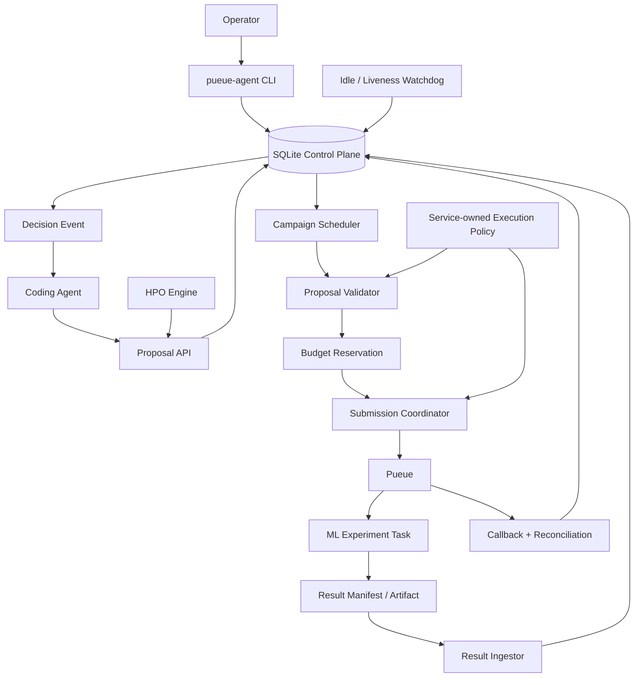
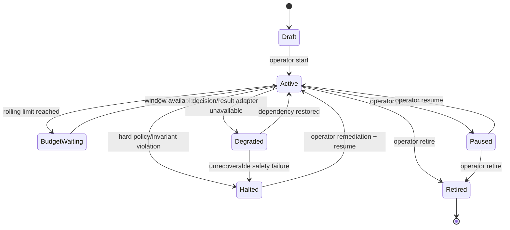
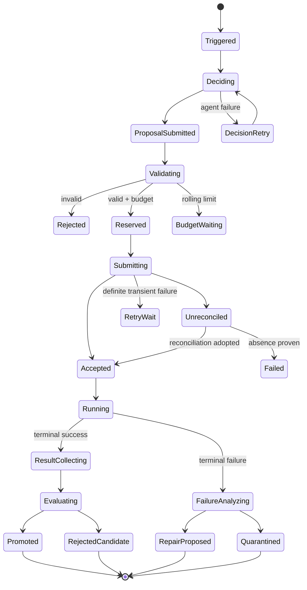

# pueue-agent 継続型 ML 実験キャンペーン基盤 完全仕様書

- 文書種別: 設計・実装仕様
- 対象: `romanohu/pueueAgent`
- 状態: Proposed
- 仕様バージョン: 1.0.0
- 作成日: 2026-08-16
- 対象領域: 長期間にわたる一般的な機械学習実験
- 対象変更: ハイパーパラメータ、学習設定、データ処理、評価処理、コード、依存関係、実行資源

---

## 目次

- [目的・適用範囲・設計原則](#1-目的)
- [全体アーキテクチャ・信頼境界・不変条件](#7-全体アーキテクチャ)
- [Campaign / Cycle 状態機械](#10-campaign-状態機械)
- [正常終了時の改善ループ](#12-正常終了時の改善ループ)
- [異常終了時の修復ループ](#13-異常終了時の修復ループ)
- [Proposal / Result / Objective protocol](#14-proposal-protocol)
- [冪等投入・budget・watchdog](#17-冪等な-submission-protocol)
- [HPO・コード変更・データ・resource](#20-hpo-と-coding-agent-の役割分離)
- [Security・設定・CLI・DB](#24-security-specification)
- [Scheduler・観測・復旧・テスト](#28-scheduler-behavior)
- [実装フェーズ・受入条件](#32-実装フェーズ)

---

## 1. 目的

本仕様は、`pueue-agent` を単なる Pueue 監視 supervisor から、**長期間にわたり機械学習実験を自律的に継続・改善・修復する durable experiment campaign controller** へ発展させるための設計と実装方針を定義する。

対象とする基本ループは次のとおりである。

```text
実験を投入
   ↓
Pueue で実行
   ↓
┌──────────────────────────────┐
│                              │
正常終了                     異常終了
│                              │
結果を定量評価               原因を診断
│                              │
改善仮説を生成               修正案を生成
│                              │
次の実験を提案               修復実験を提案
│                              │
└──────────────┬───────────────┘
               ↓
       supervisor が検証
               ↓
       冪等かつ安全に投入
               ↓
          継続的に反復
```

キャンペーンは、オペレーターが停止するか、安全上の理由で明示的に halt されない限り継続する。評価値の停滞、仮説の棄却、個別実験の失敗は、キャンペーン全体の終了条件にはしない。

一方で、同一障害、同一候補、同一 lineage に対する再試行は有限とし、無限再投入や GPU 資源の暴走を防止する。

---

## 2. 規範用語

本仕様では、以下の用語を規範的に用いる。

- **MUST / 必須**: 実装が満たさなければならない。
- **MUST NOT / 禁止**: 実装してはならない。
- **SHOULD / 推奨**: 原則として満たす。逸脱時は理由を記録する。
- **SHOULD NOT / 非推奨**: 原則として避ける。
- **MAY / 任意**: 実装上の選択肢である。

---

## 3. 適用範囲

### 3.1 対象

本仕様は、次のような長期間 ML 実験を対象とする。

- ハイパーパラメータ探索
- 学習レシピの変更
- モデル構造の変更
- 損失関数や optimizer の変更
- データ前処理、augmentation、sampling の変更
- 学習コードや評価コードの修正
- checkpoint からの再開
- エラー修復後の再投入
- 複数 seed による再現確認
- candidate model の昇格・棄却
- 長時間実行中の stall、OOM、NaN、例外、I/O 障害への対応

### 3.2 対象外

初期実装では、次を対象外とする。

- 複数ユーザー間の公平なクラスター課金
- Kubernetes、Slurm、Ray などの完全な代替
- LLM が独自に研究目的そのものを変更すること
- protected branch への無条件な自動マージ
- credential の生成・ローテーション
- 人間の承認が必要な法的・倫理的判断
- service account が侵害された場合の防御

### 3.3 基本前提

- Pueue は task 実行基盤として利用する。
- Rust supervisor と SQLite は durable control plane を構成する。
- coding agent は必要なときだけ起動する。
- project root、project 設定、agent 出力、実験コード、ログは untrusted input として扱う。
- service-owned policy、service state directory、検証済み binary は trusted boundary とする。

---

## 4. 現行実装を基準とした変更点

現行の `pueue-agent` は、以下を既に備えている。

- Pueue submission intent の永続化
- callback と status reconciliation
- SQLite event、incident、agent run、submission の lineage
- event lease と retry
- `completion`、`failure`、`crash`、`stalled`、`deep_check`、`operator_wake` の dispatch mode
- Codex 起動 policy、native launch gate、bounded diagnostics
- `status`、`doctor`、`runs`、`events`、`inspect`、`explain`、`steer`、`wake`
- typed submission metadata
- durable batch submission

本仕様では、これを次のように拡張する。

| 現状 | 目標状態 |
| --- | --- |
| agent が必要なら直接 `submit` | agent は proposal を提出し、supervisor が投入 |
| agent run retry と実験再投入が混在 | decision retry と experiment retry を分離 |
| `submission_id` 単位の冪等性 | campaign / source event / proposal slot 単位の冪等性 |
| Scheduler 起動前に budget 判定 | submission intent 作成時に atomic budget reservation |
| agent-writable state が budget を上書き可能 | hard limit は service-owned policy のみ |
| cumulative experiment limit | rolling limit と concurrency limit |
| 正常終了後は任意継続 | continuous campaign では次の proposal を必須化 |
| idle 時に停止し得る | campaign idle watchdog で自己再始動 |
| 任意 metadata に lineage | typed parent / source / attempt / failure fingerprint |
| ログ中心の評価 | versioned result manifest を優先 |
| 同じ working tree を継続変更 | experiment ごとの immutable commit / worktree |
| batch crash window で重複可能 | external-side-effect unknown を unreconciled として遮断 |

---

## 5. 設計原則

### 5.1 Campaign は無期限、lineage は有限

```text
campaign lifecycle: continuous
failure lineage retry: bounded
proposal retry: bounded
agent process retry: bounded
```

キャンペーンは停滞しても探索戦略を変更して継続する。同一 failure fingerprint に対する修復試行は設定回数を超えたら quarantine し、別候補へ移る。

### 5.2 Agent は判断し、supervisor は実行を承認する

agent が直接 Pueue へ複数 task を投入する構造は禁止する。

```text
agent
  └─ structured proposal
          ↓
supervisor
  ├─ schema validation
  ├─ policy validation
  ├─ idempotency check
  ├─ source task terminal check
  ├─ budget reservation
  ├─ code revision verification
  └─ Pueue submission
```

### 5.3 Unknown は retry しない

外部副作用が発生した可能性を否定できない状態では、同じ操作を自動再実行してはならない。

```text
Pueue add 成功が確定       → accepted
Pueue add 失敗が確定       → failed / retryable
Pueue add 結果が不明       → unreconciled
```

`unreconciled` は Pueue status との照合が完了するまで再投入禁止とする。

### 5.4 Hard policy は agent から変更不能

experiment 数、GPU 時間、agent run 数、network、custom executable、resource class、code change permission などの hard policy は service-owned state に置く。

project-owned 設定は hard policy を狭めることだけを許可する。

### 5.5 実験は再現可能な tuple として識別する

各実験は最低限、次で識別される。

\[
E_i = (
\text{code revision},
\text{config digest},
\text{dataset fingerprint},
\text{environment digest},
\text{seed},
\text{resource class}
)
\]

この tuple が同一で、目的も同一の task は、明示的な replication でない限り重複候補とみなす。

### 5.6 Plateau は停止理由ではない

一定回数改善しない場合、campaign は停止せず、探索モードを切り替える。

```text
local tuning
  → broader HPO
  → training recipe change
  → code / architecture change
  → data / evaluation analysis
  → strategy refresh
```

### 5.7 安全性と liveness を分離する

- 安全性違反: halt 可能
- rolling budget 消費: window 待機
- 改善停滞: strategy refresh
- 一時的インフラ障害: backoff retry
- agent 判断失敗: decision retry または deterministic fallback

---

## 6. 用語

| 用語 | 定義 |
| --- | --- |
| Project | 監視対象のコード・設定・artifact を含むルート |
| Campaign | 1つの目的関数と policy のもとで継続する実験系列 |
| Cycle | 1つの結果または障害から次の experiment を決める単位 |
| Proposal | agent または optimizer が生成する次の実験・修復・評価提案 |
| Proposal slot | 1つの source event から作成可能な子 proposal の論理位置 |
| Experiment intent | 外部 Pueue task を作る前に永続化される実行意図 |
| Experiment | 受理済み intent と Pueue task の組 |
| Lineage | parent experiment、source event、repair attempt の関係 |
| Failure fingerprint | failure class と bounded evidence から作る安定識別子 |
| Result manifest | 実験結果を機械可読に記述する versioned JSON |
| Objective | primary metric、制約、promotion 規則を含む固定目標 |
| Candidate | best model への昇格候補 |
| Promotion | candidate を campaign の current best として採用すること |
| Quarantine | 特定候補・lineage の自動再実行を停止すること |
| Rolling budget | 一定時間窓内で消費可能な experiment 数・GPU 時間等 |
| Hard halt | policy、整合性、安全境界違反による自動停止 |

---

## 7. 全体アーキテクチャ



### 7.1 コンポーネント責務

| コンポーネント | 主責務 |
| --- | --- |
| Pueue | process queue、task lifecycle、group concurrency |
| SQLite | campaign、proposal、intent、event、result、budget の source of truth |
| Campaign Scheduler | cycle 起動、event claim、one-slot、watchdog event 処理 |
| Proposal Validator | schema、policy、lineage、revision、resource、重複の検証 |
| Submission Coordinator | atomic reservation、Pueue add、unreconciled 管理 |
| Result Ingestor | result manifest の検証・永続化・評価 event 生成 |
| Coding Agent | 仮説生成、失敗診断、コード修正、proposal 作成 |
| HPO Engine | deterministic な parameter suggestion と observation |
| Execution Policy | executable、network、environment、resource、hard budget |
| Operator CLI | campaign 制御、診断、手動介入、承認、停止 |

---

## 8. 信頼境界と状態所有

| 状態 | 所有者 | agent 書込 | 役割 |
| --- | --- | ---: | --- |
| service `execution-policy.toml` | service operator | 不可 | hard security / budget policy |
| SQLite control DB | supervisor | CLI 経由のみ | durable state machine |
| active campaign objective snapshot | supervisor | 不可 | campaign 目標の固定 |
| project `.pueue-agent/config.toml` | project | 可 | soft request、検出設定 |
| project `.pueue-agent/state.json` | project / agent | 可 | current facts と next action の投影 |
| `STATE.md` | human / agent | 可 | 人間向け補足 |
| result manifest | experiment | 可 | validated result input |
| proposal payload | agent / optimizer | CLI 経由 | untrusted decision input |
| source code / worktree | agent | policy 次第 | experiment candidate code |

### 8.1 `state.json` の変更

`state.json` から hard budget を除去する。

許可する例:

```json
{
  "schema_version": 2,
  "campaign_id": "...",
  "current_facts": [],
  "historical_fact_refs": [],
  "next_action": "analyze completed experiment",
  "active_lineage": {
    "event_id": 42,
    "agent_run_id": 18,
    "proposal_id": null,
    "experiment_id": "..."
  },
  "current_best_experiment_id": "...",
  "strategy_stage": "local_hpo"
}
```

禁止するもの:

- `max_experiments`
- `max_agent_runs`
- `max_gpu_hours`
- network permission
- executable allowlist
- code-change permission

---

## 9. 不変条件

実装は次を常に満たさなければならない。

### I-1. Proposal slot の一意性

同一 campaign、source event、proposal slot から dispatch される proposal は最大1件とする。

```sql
UNIQUE(campaign_id, source_event_id, proposal_slot)
```

### I-2. Accepted experiment の非再投入

accepted、adopted、running、terminal の experiment intent は、同じ idempotency key で再度 Pueue add してはならない。

### I-3. Unknown external side effect の遮断

Pueue add の結果が不明な intent は `unreconciled` とし、照合完了まで再投入しない。

### I-4. Budget reservation の atomicity

experiment intent の作成と rolling budget slot の予約は、同一 SQLite `BEGIN IMMEDIATE` transaction 内で行う。

### I-5. Hard policy の service ownership

agent-writable file の変更によって hard limit を拡大できてはならない。

### I-6. Replacement の terminal gate

既存 task の replacement は、source task が terminal であるか、operator が明示的に concurrent replacement を許可した場合に限る。

### I-7. Active campaign の liveness

active campaign は、hard halt でない限り、次のいずれかの durable 状態へ必ず進む。

- experiment running
- proposal pending
- reconciliation waiting
- rolling budget window waiting
- retry backoff waiting
- strategy refresh scheduled

silent idle は許可しない。

### I-8. Failure lineage の有限性

同一 failure fingerprint に対する自動 repair attempt は hard policy 上限を超えてはならない。

### I-9. Revision の不変性

accepted experiment が参照する code revision、config digest、dataset fingerprint は実行後に変更してはならない。

### I-10. Secret 非永続化

credential value、API token、authorization header、raw environment map を SQLite、proposal、result、diagnostic output に保存してはならない。

### I-11. One active decision per campaign

同一 campaign について、通常は active decision agent run を最大1件とする。将来の並列 decision は別仕様とする。

### I-12. Campaign objective の固定

active campaign の objective を agent が変更してはならない。変更は operator action と新しい objective version を必要とする。

---

## 10. Campaign 状態機械



### 10.1 状態定義

- `Draft`: objective と policy がまだ固定されていない。
- `Active`: 自律 cycle を継続する。
- `BudgetWaiting`: rolling window が空くまで待機する。停止ではない。
- `Degraded`: 自動判断や評価の一部が利用不能だが、状態は保全されている。
- `Paused`: operator が自動 dispatch を停止した。
- `Halted`: 安全性・整合性違反により supervisor が停止した。
- `Retired`: campaign を終了し、再開不可とした。

### 10.2 Halt 条件

次のみ hard halt とする。

- service-owned policy 読み込み失敗
- executable / project root anchor 置換
- DB invariant 破損
- result / proposal schema の持続的な攻撃的入力
- budget accounting の不整合
- unknown external side effect の解決不能が設定上限を超過
- storage / filesystem ownership の安全確認不能
- operator による halt

次は halt 条件ではない。

- metric が改善しない
- candidate が baseline を下回る
- individual experiment failure
- rolling budget の消費
- HPO search space の枯渇
- agent が一度 proposal を生成できなかった

---

## 11. Cycle 状態機械



各 terminal cycle は、次の cycle を起動する event を生成する。

---

## 12. 正常終了時の改善ループ

### 12.1 処理順序

1. Pueue task の terminal success を確認する。
2. result manifest を取得・検証する。
3. experiment tuple と metric を永続化する。
4. objective に従い candidate を評価する。
5. promotion、replication、追加評価、棄却のいずれかを決定する。
6. coding agent または HPO engine が次 proposal を作成する。
7. supervisor が proposal を検証して投入する。

### 12.2 改善判定

primary metric が maximize の場合:

\[
\Delta = m_{candidate} - m_{best}
\]

`min_delta` を超えた場合にのみ改善候補とする。

```text
Δ > min_delta       → improvement candidate
|Δ| <= min_delta    → statistically inconclusive / plateau
Δ < -min_delta      → regression
```

単一 run の改善だけで current best に昇格させない設定を既定とする。

### 12.3 Promotion pipeline

```text
proxy evaluation
   ↓
replication with multiple seeds
   ↓
constraint check
   ↓
full evaluation
   ↓
periodic protected holdout
   ↓
promotion
```

promotion policy は objective snapshot に固定する。

例:

```json
{
  "replications": 3,
  "minimum_successful_replications": 3,
  "aggregation": "median",
  "minimum_delta": 0.002,
  "require_all_constraints": true,
  "holdout_every_promotions": 5
}
```

### 12.4 Plateau 処理

連続非改善回数に応じて strategy stage を変更する。

| 非改善 cycle | 既定動作 |
| ---: | --- |
| 1–3 | current best 周辺の局所探索 |
| 4–8 | search range 拡張、別 seed、scheduler 等 |
| 9–15 | training recipe / model component 変更 |
| 16–25 | data pipeline / evaluation analysis |
| 26 以上 | strategy refresh agent を起動し、新しい探索計画を作成 |

数値は service policy または objective で変更可能とする。

### 12.5 Candidate 棄却

棄却結果も durable fact として保存する。

```text
hypothesis
change set
result
reason for rejection
failure / constraint violation
```

同一 proposal digest を再生成しないため、negative result を optimizer と agent context に返す。

---

## 13. 異常終了時の修復ループ

### 13.1 Failure class

| class | 例 | 既定処理 |
| --- | --- | --- |
| `infrastructure_transient` | 一時的 I/O、daemon 接続、network | same-spec retry |
| `resource_exhaustion` | CUDA OOM、disk full、RAM不足 | resource / batch repair |
| `numerical_instability` | NaN、Inf、divergence | LR、precision、clip、input check |
| `code_defect` | exception、assert、shape mismatch | code repair + tests |
| `data_defect` | missing sample、schema mismatch | data validation / regeneration |
| `artifact_defect` | checkpoint破損、manifest欠損 | fallback / regenerate |
| `timeout_or_stall` | heartbeat停止、walltime超過 | liveness確認、cancel、resume |
| `policy_blocked` | executable、network、session違反 | 自動修復禁止、operator remediation |
| `unknown` | 分類不能 | bounded diagnosis、再投入禁止を既定 |

### 13.2 Failure fingerprint

fingerprint は次から service 側で生成する。

```text
failure_class
normalized exception type
normalized top stack frames
exit code / signal
resource code
bounded detector pattern IDs
code revision
```

raw log 全体を fingerprint に含めない。

### 13.3 Retry と repair の区別

- **Retry**: code、config、data、revision を変えず再実行する。
- **Repair**: code、config、resource、checkpoint 等を変更して再実行する。

Retry は infrastructure transient に限定する。OOM や deterministic exception を同一 spec のまま retry しない。

### 13.4 Lineage retry 上限

```toml
max_same_spec_retries = 2
max_repairs_per_failure_fingerprint = 2
max_total_children_per_failed_experiment = 3
```

上限到達時は、その lineage を `quarantined` にする。campaign は別候補へ進む。

### 13.5 Stall 処理

stall は task failure と同義ではない。

replacement の前に次を確認する。

1. Pueue status
2. process existence
3. heartbeat / metric timestamp
4. GPU activity または task-specific liveness signal
5. cancel / termination confirmation

source task が実行中のまま replacement を投入してはならない。例外は operator が `allow_concurrent_replacement=true` を明示した場合のみとする。

### 13.6 Checkpoint resume

repair proposal が checkpoint を利用する場合、次を記録する。

- checkpoint URI / relative path
- digest
- source experiment ID
- source code revision
- compatible config digest
- completed epoch / step

checkpoint compatibility が検証できない場合は新規学習として扱う。

---

## 14. Proposal protocol

### 14.1 基本方針

managed campaign mode では、agent は `pueue-agent submit` を直接使用してはならない。

agent は次を使用する。

```bash
pueue-agent proposal submit --stdin
```

または:

```bash
pueue-agent proposal submit --file proposal.json
```

CLI は active agent run、project、campaign の一致を検証する。

### 14.2 Proposal schema

```json
{
  "schema_version": 1,
  "campaign_id": "018f...",
  "source": {
    "event_id": 417,
    "experiment_id": "018f...",
    "failure_id": null
  },
  "proposal_slot": "primary",
  "kind": "hpo_trial",
  "hypothesis": "Reduce learning rate after observed late-stage instability",
  "change_set": {
    "hyperparameters": {
      "optimizer.lr": {
        "before": 0.0001,
        "after": 0.00005
      }
    }
  },
  "execution": {
    "argv": ["python", "train.py", "--lr", "0.00005"],
    "working_directory": ".",
    "code_revision": "abc123...",
    "config_digest": "sha256:...",
    "dataset_fingerprint": "sha256:...",
    "environment_digest": "sha256:...",
    "seed": 42,
    "resource_class": "gpu-default"
  },
  "expected": {
    "primary_metric": "validation_loss",
    "direction": "minimize",
    "rationale": "Lower LR should reduce oscillation"
  },
  "preconditions": [
    "source_task_terminal",
    "required_tests_passed"
  ]
}
```

### 14.3 Proposal kind

- `hpo_trial`
- `training_recipe_change`
- `code_change`
- `data_change`
- `repair`
- `same_spec_retry`
- `replication`
- `full_evaluation`
- `holdout_evaluation`
- `control`
- `strategy_refresh`

### 14.4 Supervisor-generated identity

agent が最終 idempotency key を決めてはならない。

supervisor は canonicalized proposal から以下を生成する。

```text
proposal_digest = SHA256(canonical proposal body)
idempotency_key = SHA256(
  campaign_id || source_event_id || proposal_slot || proposal_digest
)
```

同じ source event と slot に dispatch 済み proposal が存在する場合、新しい proposal は作らない。

### 14.5 Proposal bundle

初期実装では1 cycle につき `primary` 1件を既定とする。

HPO で複数 trial を生成する場合は bundle を許可する。

```text
proposal_slot = trial:000
proposal_slot = trial:001
proposal_slot = trial:002
```

bundle size は hard policy で制限する。

### 14.6 Proposal validation

必須検証:

- JSON schema version
- campaign active
- source event belongs to campaign
- source event status
- proposal slot uniqueness
- kind permission
- argv size / encoding / NUL
- working directory containment
- code revision existence
- clean commit / immutable worktree
- config digest consistency
- dataset fingerprint presence
- resource class allowlist
- source task terminal precondition
- experiment duplicate check
- rolling budget availability
- required checks result

### 14.7 Agent exit without proposal

agent が正常終了したにもかかわらず proposal を提出しなかった場合:

1. `decision_missing` event を生成する。
2. bounded backoff で decision retry する。
3. retry 上限後、HPO engine に suggestion があれば deterministic fallback を作る。
4. fallback がなければ campaign を `Degraded` にし、`strategy_refresh` を定期生成する。
5. campaign を自動 retire しない。

---

## 15. Result manifest

### 15.1 目的

ログ解析のみで結果を判断することを避け、機械可読で再現可能な評価を実現する。

### 15.2 出力場所

supervisor は task に次を渡す。

```text
PUEUE_AGENT_EXPERIMENT_ID
PUEUE_AGENT_RESULT_PATH
PUEUE_AGENT_ARTIFACT_DIR
PUEUE_AGENT_CAMPAIGN_ID
```

result は temporary file へ書き、atomic rename で publish する。

### 15.3 Schema

```json
{
  "schema_version": 1,
  "experiment_id": "018f...",
  "status": "completed",
  "code_revision": "abc123...",
  "config_digest": "sha256:...",
  "dataset_fingerprint": "sha256:...",
  "environment_digest": "sha256:...",
  "seed": 42,
  "started_at": "2026-08-16T10:00:00Z",
  "finished_at": "2026-08-16T12:35:00Z",
  "metrics": {
    "validation_loss": 0.182,
    "accuracy": 0.941,
    "throughput_samples_per_second": 321.5
  },
  "primary_metric": "validation_loss",
  "artifacts": [
    {
      "kind": "checkpoint",
      "path": "artifacts/best.pt",
      "digest": "sha256:...",
      "size_bytes": 123456789
    }
  ],
  "resource_usage": {
    "gpu_seconds": 9100,
    "cpu_seconds": 4200,
    "max_rss_bytes": 34359738368
  },
  "notes": []
}
```

### 15.4 Validation

- metric value は finite number のみ。
- path は experiment artifact root 相対。
- artifact path traversal を禁止。
- manifest 最大サイズを設定する。
- experiment ID、revision、digest は intent と一致しなければならない。
- task exit 0 でも manifest が必須設定の場合、欠損は `artifact_defect:result_missing` とする。

### 15.5 Legacy adapter

既存学習コードが manifest を生成しない場合、adapter を利用できる。

優先順位:

1. native result manifest
2. project-defined result adapter の validated JSON
3. agent による bounded log analysis

3 の結果だけでは automatic promotion を行わない。明示的な objective policy が必要である。

---

## 16. Objective と評価仕様

### 16.1 Objective snapshot

campaign start 時に objective JSON を SQLite へ immutable snapshot として保存する。

```json
{
  "schema_version": 1,
  "primary": {
    "metric": "validation_loss",
    "direction": "minimize",
    "minimum_delta": 0.001
  },
  "constraints": [
    {
      "metric": "peak_gpu_memory_bytes",
      "operator": "<=",
      "value": 24000000000
    },
    {
      "metric": "inference_latency_ms",
      "operator": "<=",
      "value": 25.0
    }
  ],
  "promotion": {
    "replications": 3,
    "aggregation": "median",
    "require_all_constraints": true,
    "holdout_every_promotions": 5
  },
  "allowed_changes": [
    "hyperparameters",
    "training_recipe",
    "code",
    "data_pipeline"
  ]
}
```

### 16.2 Multi-objective

v1 では primary objective + hard constraints を基本とする。

真正の Pareto optimization は optional extension とし、promotion rule を明示しない限り有効化しない。

### 16.3 Protected holdout

holdout metric は通常 cycle の agent prompt に毎回渡さない。

- promotion cadence 時のみ評価
- 結果閲覧を bounded projection に制限
- holdout overfitting を避けるため query budget を記録

### 16.4 Baseline

campaign は start 時に baseline experiment を1件以上必要とする。

baseline がない場合:

- existing result を import する
- または baseline proposal を最初に投入する

---

## 17. 冪等な submission protocol

### 17.1 単発 experiment

```text
proposal accepted
    ↓
BEGIN IMMEDIATE
    - idempotency key lookup
    - proposal slot check
    - duplicate tuple check
    - rolling budget check
    - budget reservation insert
    - experiment intent insert(status=reserved)
COMMIT
    ↓
Pueue add
    ├─ definite success → accepted
    ├─ definite failure → failed/retry_wait
    └─ unknown          → unreconciled
```

### 17.2 Intent 状態

- `reserved`
- `submitting`
- `accepted`
- `adopted`
- `unreconciled`
- `running`
- `succeeded`
- `failed`
- `cancelled`
- `quarantined`

### 17.3 Same-key behavior

| 既存状態 | 同じ key の要求 |
| --- | --- |
| `reserved` / `submitting` | 既存 intent を返す。新規 add 禁止 |
| `accepted` / `adopted` / `running` | 既存 task ID を返す |
| terminal | 既存結果を返す。replication は別 slot が必要 |
| `unreconciled` | reconciliation を要求。再投入禁止 |
| definite pre-add failure | policy 上許可されれば同一 intent の retry |

### 17.4 Pueue reconciliation

照合には次を利用する。

- project group
- task ID
- canonical command digest
- enqueue time window
- supervisor-generated experiment correlation token
- task environment / managed wrapper metadata

候補が一意である場合のみ `adopted` とする。

### 17.5 Batch submission

batch は proposal bundle と統合する。

必須変更:

- batch job に `origin_agent_run_id`、`campaign_id`、`proposal_id` を保持
- accepted job は再投入禁止
- Pueue add 後・DB result 前の crash は `unreconciled` job とする
- expired lease で `dispatching` を単純に `pending` に戻してはならない
- recovery は submission intent と Pueue status を照合してから状態を決める

---

## 18. Budget と resource policy

### 18.1 Rolling limit

累積上限だけでは継続 campaign が最終的に停止するため、rolling limit を採用する。

```toml
[campaign_defaults.limits]
max_parallel_experiments = 1
max_new_experiments_per_24h = 24
max_agent_runs_per_hour = 6
max_gpu_seconds_per_24h = 86400
max_code_change_proposals_per_24h = 10
max_same_spec_retries = 2
max_repairs_per_failure_fingerprint = 2
max_proposals_per_cycle = 1
```

### 18.2 Budget waiting

limit 到達時は campaign を pause / halt しない。

- intent は作らない
- `BudgetWaiting` と `next_eligible_at` を永続化
- window が開いたら watchdog が再開 event を生成

### 18.3 Reservation accounting

budget 計算には以下を含める。

- accepted experiments
- running experiments
- reserved intents
- submitting / unreconciled intents

definite pre-add failure、validation rejection、expired unused reservation は release する。

### 18.4 GPU 時間

実績 GPU 時間が取得できない場合は、request walltime × GPU count で保守的に予約する。

終了後に actual usage で精算する。

### 18.5 Service policy と project request

有効値は原則として次とする。

\[
L_{effective} = \min(L_{service}, L_{project})
\]

project が値を省略した場合は service default を使用する。

---

## 19. Idle / Liveness watchdog

### 19.1 Idle 判定

以下をすべて満たす active campaign は idle とみなす。

- running Pueue experiment = 0
- active agent run = 0
- pending / claimed / in-flight decision event = 0
- reserved / submitting / unreconciled intent = 0
- budget waiting ではない
- retry backoff waiting ではない

### 19.2 Idle event

`idle_grace_minutes` 経過後に `campaign_idle` event を一意に生成する。

```text
campaign-idle:v1:<campaign-id>:<idle-epoch>
```

### 19.3 Busy-loop 防止

- idle event に minimum interval を設定
- agent failure は exponential backoff
- no-proposal cycle は retry count を増加
- degraded campaign は periodic strategy refresh のみ

### 19.4 Liveness SLO

正常な service と利用可能な budget のもとで、active campaign は `idle_grace_minutes + scheduler_interval + decision_timeout` 以内に次の durable action を開始することを目標とする。

---

## 20. HPO と coding agent の役割分離

### 20.1 二層構造

```text
Coding Agent
  ├─ 仮説生成
  ├─ search space 変更
  ├─ code / data / recipe 変更
  ├─ failure diagnosis
  └─ strategy stage 変更

Deterministic HPO Engine
  ├─ parameter suggestion
  ├─ trial deduplication
  ├─ observation
  ├─ pruning decision
  └─ optimizer state persistence
```

### 20.2 HPO interface

```text
suggest(campaign_id, search_space_version, n) -> suggestions
observe(trial_id, result) -> optimizer state update
fail(trial_id, failure_class) -> optimizer state update
```

optimizer state は SQLite または versioned external store に永続化する。

### 20.3 Built-in initial engines

- grid
- random with deterministic seed
- successive halving compatible queue

Optuna 等の外部 engine は adapter として追加可能とする。

### 20.4 Duplicate trial

同一 normalized parameter set、code revision、dataset fingerprint、seed の trial は replication でない限り作成しない。

---

## 21. コード変更を伴う実験

### 21.1 基本要件

code change proposal は次を満たす。

- isolated worktree
- clean base revision
- intentional commit
- required checks 成功
- diff size / file scope policy
- commit SHA の永続化
- experiment は commit SHA 固定

### 21.2 Worktree lifecycle

```text
current best commit
    ↓
create worktree for agent run
    ↓
agent modifies code
    ↓
format / unit / smoke checks
    ↓
commit candidate
    ↓
proposal references commit
    ↓
immutable experiment worktree
    ↓
result evaluation
    ├─ promoted → candidate branch update
    └─ rejected → archive / cleanup
```

### 21.3 Branch policy

既定:

- protected `main` へ自動 push / merge しない
- `campaign/<campaign-id>/best` を current best branch とする
- candidate は `campaign/<campaign-id>/candidate/<proposal-id>`
- promotion は fast-forward または明示された merge strategy

GitHub PR 作成は optional integration とする。

### 21.4 Required checks

project は soft request を定義できるが、service policy が最低限を強制する。

例:

```toml
[campaign.code_changes]
allow = true
require_commit = true
max_changed_files = 50
max_diff_bytes = 500000
required_commands = [
  ["python", "-m", "pytest", "tests/smoke"],
  ["python", "-m", "compileall", "src"]
]
```

### 21.5 Native execution の危険性

agent-generated code を host 上で実行する場合、専用 unprivileged OS account を必須とする。

`allow_code_changes = true` の campaign では、rootless container backend を SHOULD とする。

---

## 22. Data と environment の versioning

### 22.1 Dataset fingerprint

最低限、次から生成する。

- dataset manifest
- file list / content digest または immutable version ID
- preprocessing version
- split definition
- label schema

### 22.2 In-place mutation 禁止

running experiment が参照する dataset version を変更してはならない。

新しい data pipeline は新しい fingerprint を生成する。

### 22.3 Environment digest

次を含める。

- Python / runtime version
- lockfile digest
- container image digest または package snapshot
- CUDA / driver compatibility projection
- relevant hardware class

credential、hostname、secret environment value は含めない。

---

## 23. Resource class

Pueue group を agent が任意指定してはならない。

service policy に resource class を定義する。

```toml
[resource_classes.gpu_default]
pueue_group = "ml-gpu-default"
max_parallel = 1
gpu_count = 1
gpu_memory_bytes = 24000000000
cpu_count = 8
ram_bytes = 68719476736
max_walltime_minutes = 1440

[resource_classes.cpu_control]
pueue_group = "ml-control"
max_parallel = 2
gpu_count = 0
cpu_count = 4
ram_bytes = 17179869184
max_walltime_minutes = 120
```

agent は allowlist 内の class 名だけを要求できる。

---

## 24. Security specification

### 24.1 Network

service default は `disabled` を推奨する。

project は service-disabled network を再有効化できない。

### 24.2 Environment

- child process は default deny を維持する。
- credential は agent process に必要な範囲だけ渡す。
- model-launched task subprocess へ auth secret を継承しない。
- experiment task の environment name allowlist は service-owned とする。

### 24.3 Arbitrary executable

- custom agent executable は service allowlist が必要。
- experiment argv の executable policy は backend ごとに定義する。
- project root 内の executable を host-trusted executable とみなさない。
- agent-generated training codeの実行は experiment sandbox の中でのみ許可することを推奨する。

### 24.4 Proposal / result input

- size、depth、key count、string length を制限
- unknown field は原則拒否
- bounded redaction
- path traversal、NUL、non-UTF-8 policy
- raw command output を DB に保存しない

### 24.5 Secrets

禁止:

- argv に token を直接含める
- submission metadata に secret を入れる
- `STATE.md` に credential を記録
- result manifest に environment value を記録

### 24.6 Human intervention

`steer` は operator input であり、system policy を上書きしない。

`resume` は halt 理由を確認した operator action として audit log に記録する。

---

## 25. Configuration

### 25.1 Service-owned policy

拡張例:

```toml
version = 2

[defaults]
network = "disabled"
execution_backend = "rootless-container"

[campaign_defaults]
mode = "continuous"
idle_grace_minutes = 5
decision_timeout_minutes = 60
result_manifest_required = true

[campaign_defaults.limits]
max_parallel_experiments = 1
max_new_experiments_per_24h = 24
max_agent_runs_per_hour = 6
max_gpu_seconds_per_24h = 86400
max_same_spec_retries = 2
max_repairs_per_failure_fingerprint = 2
max_proposals_per_cycle = 1

[campaign_defaults.code_changes]
allow = false
require_isolated_worktree = true
require_commit = true

[executables]
codex = "codex"
pueue = "pueue"
git = "git"
```

### 25.2 Project config

project config は active campaign snapshot の入力であり、start 後に agent が変更しても即時反映しない。

```toml
[campaign]
mode = "continuous"
objective_file = ".pueue-agent/objective.json"
idle_grace_minutes = 10
result_manifest_required = true

[campaign.search]
initial_stage = "local_hpo"
allowed_change_kinds = ["hyperparameters", "training_recipe", "code"]

[campaign.limits]
max_parallel_experiments = 1
max_new_experiments_per_24h = 12

[campaign.code_changes]
allow = true
required_commands = [
  ["python", "-m", "pytest", "tests/smoke"]
]
```

project value は service valueを拡大できない。

### 25.3 Config update

active campaign の設定変更は次を必要とする。

```bash
pueue-agent campaign plan-update --file .pueue-agent/config.toml
pueue-agent campaign apply-update --plan-id <ID>
```

agent は `apply-update` を実行できない。

---

## 26. CLI specification

### 26.1 Campaign

```bash
pueue-agent campaign init
pueue-agent campaign start --objective objective.json
pueue-agent campaign status [--json]
pueue-agent campaign pause
pueue-agent campaign resume
pueue-agent campaign halt --reason <TEXT>
pueue-agent campaign retire
pueue-agent campaign wake --reason <TEXT>
```

### 26.2 Proposal

```bash
pueue-agent proposal submit --stdin
pueue-agent proposal list [--status ...]
pueue-agent proposal inspect <PROPOSAL_ID>
pueue-agent proposal reject <PROPOSAL_ID> --reason <TEXT>
pueue-agent proposal validate --file proposal.json
```

`proposal submit` は active agent run からのみ許可する。

### 26.3 Experiment

```bash
pueue-agent experiment list
pueue-agent experiment inspect <EXPERIMENT_ID>
pueue-agent experiment lineage <EXPERIMENT_ID>
pueue-agent experiment cancel <EXPERIMENT_ID>
pueue-agent experiment reconcile <EXPERIMENT_ID>
pueue-agent experiment retry <EXPERIMENT_ID> --operator-approved
```

### 26.4 Budget

```bash
pueue-agent budget status
pueue-agent budget history
pueue-agent budget reservations
```

### 26.5 Existing command compatibility

- unmanaged project の `submit` は維持可能。
- managed campaign では agent-origin direct `submit` を拒否する。
- operator-origin direct `submit` は `--attach-campaign` を明示した場合のみ campaign lineage に入れる。

---

## 27. Database schema

### 27.1 `campaigns`

主要列:

```sql
campaign_id TEXT PRIMARY KEY,
project_id TEXT NOT NULL,
status TEXT NOT NULL,
mode TEXT NOT NULL,
objective_version INTEGER NOT NULL,
objective_json TEXT NOT NULL,
policy_snapshot_json TEXT NOT NULL,
strategy_stage TEXT NOT NULL,
current_best_experiment_id TEXT,
idle_epoch INTEGER NOT NULL DEFAULT 0,
next_wake_at INTEGER,
created_at INTEGER NOT NULL,
updated_at INTEGER NOT NULL
```

v1 では `UNIQUE(project_id)` により active campaign を1件に制限してよい。

### 27.2 `proposals`

```sql
proposal_id TEXT PRIMARY KEY,
campaign_id TEXT NOT NULL,
source_event_id INTEGER NOT NULL,
source_experiment_id TEXT,
source_failure_id TEXT,
proposal_slot TEXT NOT NULL,
kind TEXT NOT NULL,
proposal_digest TEXT NOT NULL,
idempotency_key TEXT NOT NULL,
canonical_json TEXT NOT NULL,
status TEXT NOT NULL,
origin_agent_run_id INTEGER,
rejection_code TEXT,
created_at INTEGER NOT NULL,
updated_at INTEGER NOT NULL,
UNIQUE(campaign_id, source_event_id, proposal_slot),
UNIQUE(campaign_id, idempotency_key)
```

### 27.3 `experiments`

既存 submissions と統合してもよいが、domain model は明示する。

```sql
experiment_id TEXT PRIMARY KEY,
campaign_id TEXT NOT NULL,
proposal_id TEXT NOT NULL,
submission_id TEXT NOT NULL UNIQUE,
parent_experiment_id TEXT,
source_event_id INTEGER NOT NULL,
proposal_slot TEXT NOT NULL,
lineage_attempt INTEGER NOT NULL,
intent_status TEXT NOT NULL,
pueue_task_id INTEGER,
resource_class TEXT NOT NULL,
code_revision TEXT NOT NULL,
config_digest TEXT NOT NULL,
dataset_fingerprint TEXT NOT NULL,
environment_digest TEXT NOT NULL,
seed INTEGER,
command_digest TEXT NOT NULL,
created_at INTEGER NOT NULL,
accepted_at INTEGER,
terminal_at INTEGER,
UNIQUE(campaign_id, proposal_id)
```

### 27.4 `budget_reservations`

```sql
reservation_id TEXT PRIMARY KEY,
campaign_id TEXT NOT NULL,
proposal_id TEXT NOT NULL,
kind TEXT NOT NULL,
amount INTEGER NOT NULL,
window_start INTEGER NOT NULL,
window_end INTEGER NOT NULL,
status TEXT NOT NULL,
expires_at INTEGER,
created_at INTEGER NOT NULL,
UNIQUE(campaign_id, proposal_id, kind)
```

### 27.5 `experiment_results`

```sql
experiment_id TEXT PRIMARY KEY,
manifest_version INTEGER NOT NULL,
manifest_digest TEXT NOT NULL,
status TEXT NOT NULL,
primary_metric_name TEXT,
primary_metric_value REAL,
metrics_json TEXT NOT NULL,
artifacts_json TEXT NOT NULL,
resource_usage_json TEXT NOT NULL,
ingested_at INTEGER NOT NULL
```

### 27.6 `failures`

```sql
failure_id TEXT PRIMARY KEY,
experiment_id TEXT NOT NULL,
failure_class TEXT NOT NULL,
fingerprint TEXT NOT NULL,
retryability TEXT NOT NULL,
evidence_json TEXT NOT NULL,
repair_attempt INTEGER NOT NULL,
created_at INTEGER NOT NULL,
UNIQUE(experiment_id, fingerprint)
```

### 27.7 `promotion_decisions`

```sql
decision_id TEXT PRIMARY KEY,
campaign_id TEXT NOT NULL,
candidate_experiment_id TEXT NOT NULL,
baseline_experiment_id TEXT,
decision TEXT NOT NULL,
reason_json TEXT NOT NULL,
created_at INTEGER NOT NULL
```

### 27.8 Migration

- existing submissions は `campaign_id=NULL` で移行
- managed campaign 開始後の新規 submission は campaign / proposal 必須
- `state.json` schema v1 budgets は service policy へ operator-assisted migration
- existing batch jobs は legacy status として保持
- migration は rollback せず、DB backup と schema version check を行う

---

## 28. Scheduler behavior

### 28.1 Tick ordering

```text
1. startup / lease recovery
2. Pueue reconciliation
3. task terminal normalization
4. result ingestion
5. failure detection / termination confirmation
6. budget window refresh
7. idle watchdog
8. event claim
9. proposal / agent dispatch
10. proposal validation
11. experiment submission
12. active handle polling / finalization
```

### 28.2 Event priority

推奨優先順位:

1. policy / execution unknown
2. task failure / crash / termination failure
3. result ingestion failure
4. task success / completion
5. operator wake
6. campaign idle
7. periodic strategy refresh
8. deep check

### 28.3 Event aggregation

複数 event を同じ agent run に束ねる場合でも、proposal の source event を1件選ぶ。

他 event は context evidence とし、proposal slot uniqueness は primary source に対して適用する。

---

## 29. Observability

### 29.1 Status projection

`campaign status` は最低限次を表示する。

- campaign state
- current best
- strategy stage
- active experiment
- pending proposal
- unreconciled intent
- rolling budget usage
- next wake time
- recent failure fingerprint
- plateau count
- service / Pueue health

### 29.2 Lineage

```text
campaign
  └─ source event
       └─ proposal
            └─ experiment intent
                 └─ Pueue task
                      ├─ result
                      └─ failure
                           └─ repair proposal
```

CLI と JSON API の両方で追跡可能にする。

### 29.3 Bounded output

- prompt 全文を表示しない
- raw logs を既定表示しない
- argv は redacted / bounded
- metadata / result は summary を表示
- secret-like token を redaction

### 29.4 Audit log

次は operator audit event を作成する。

- campaign start / pause / resume / halt / retire
- objective update
- policy update
- manual retry
- concurrent replacement approval
- quarantine解除
- promotion override

### 29.5 Long-term agent context

長期 campaign の履歴を会話 transcript や単一の Codex session に保持してはならない。SQLite と versioned artifact を authoritative memory とする。

各 decision agent run に渡す context bundle は bounded かつ再構成可能とし、最低限次を含める。

- immutable objective snapshot と policy summary
- current best experiment と promotion evidence
- strategy stage、plateau count、次の探索意図
- source event / experiment / failure の bounded evidence
- 直近の実験結果
- 関連する negative results と既試行 proposal digest
- unresolved / unreconciled state
- rolling budget summary と resource availability
- operator intervention

full database history、raw transcript、全ログを prompt に連結してはならない。必要な履歴は query によって選択し、context bundle の digest と生成 version を agent run に記録する。

既定は fresh agent context とする。session resume を利用する場合でも、SQLite の campaign state を source of truth とし、会話記憶から budget、lineage、best candidate を復元してはならない。

### 29.6 Retention、scale、performance

campaign は無期限に継続し得るため、全履歴を `state.json` や diagnostic output に保持してはならない。

- SQLite には proposal、experiment、result、failure、promotion の durable metadata を保持する。
- raw logs と大規模 artifact は外部 artifact directory / store に置き、DB には digest と location だけを保存する。
- active lineage、unreconciled intent、current best、budget reservation は archive 対象外とする。
- terminal history は policy に従い export / archive できるが、idempotency と lineage に必要な key は tombstone として保持する。
- CLI query は必ず project / campaign scope、index、LIMIT、cursor pagination を使用する。
- scheduler tick は全履歴 scan を行わず、status と `next_wake_at` に対する indexed query を使用する。
- timestamp は UTC epoch を canonical とし、表示時だけ locale 変換する。
- JSON、proposal、result、policy snapshot は schema version を必須とする。

目標規模は、単一 service instance 当たり最低10万 experiment metadata、100万 event metadata を、bounded status query と scheduler tick の全件 scan なしで扱えることとする。

---

## 30. Recovery semantics

### 30.1 Crash point matrix

| crash point | recovery |
| --- | --- |
| proposal DB insert 前 | source event retry可能 |
| proposal insert 後、validation 前 | validator が再開 |
| budget reservation 後、Pueue add 前 | intent を再開可能 |
| Pueue add 呼出前に definite failure | reservation release / retry |
| Pueue add 成功後、DB accepted 前 | unreconciled、status照合 |
| accepted 後、task start 前 | Pueue statusから継続 |
| task terminal 後、event生成前 | reconciliation が terminal event生成 |
| result publish 後、ingest前 | result ingestor が再実行 |
| agent proposal submit 後、agent exit前 | slot uniqueness により重複なし |
| agent exit後、proposalなし | decision_missing event |

### 30.2 Daemon restart

restart 時に次を行う。

- expired event lease recovery
- stale agent run recovery
- unreconciled intent scan
- budget reservation recovery
- managed worktree inventory
- active campaign idle evaluation

### 30.3 Result unknown

post-marker / external execution unknown は自動再実行しない。operator または一意な reconciliation が必要である。

### 30.4 Cleanup

experiment worktree、private temp、artifact staging の cleanup は terminal DB commit 後に行う。

cleanup failure は experiment result を巻き戻さず、同じ capability を保持して retry する。

---

## 31. Testing specification

### 31.1 Unit tests

- proposal canonicalization
- idempotency key generation
- rolling window calculation
- budget reservation
- failure fingerprint normalization
- objective comparison
- promotion decision
- state transition guards
- result schema validation
- path / size / depth bounds

### 31.2 Database integration tests

- proposal slot unique constraint
- concurrent budget reservation race
- same-key duplicate submission
- unknown external side effect
- parent / child lineage
- quarantine limits
- campaign idle uniqueness
- migration from current schema

### 31.3 Pueue adapter tests

- add success
- definite add failure
- timeout / ambiguous result
- status adoption
- duplicate task candidates
- task ID reuse
- group mismatch
- terminal source gate

### 31.4 Agent tests

- completion proposal
- failure repair proposal
- code-change commit verification
- agent exit without proposal
- retrying agent returns existing proposal
- malicious proposal attempts to widen policy

### 31.5 E2E tests

Linux CI で real Pueue daemon と fake agent / fake experiment を使用する。

必須 scenario:

1. 正常終了 → metric ingest → next experiment
2. metric improvement → replication → promotion
3. regression → candidate reject → different proposal
4. CUDA OOM simulation → batch repair → resubmit
5. deterministic exception → code repair → tests → resubmit
6. stall → cancel confirmation → replacement
7. Pueue add success直後 crash → no duplicate
8. campaign idle → watchdog wake
9. rolling budget exhaustion → BudgetWaiting → automatic resume
10. repeated same failure → quarantine → campaign continues elsewhere
11. agent decision failure → retry / fallback
12. daemon restart during each protocol phase

### 31.6 Security tests

- agent cannot modify hard budget
- project cannot re-enable disabled network
- source path symlink replacement
- worktree escape
- result artifact path traversal
- secret redaction
- oversized proposal / manifest
- custom executable not enrolled
- concurrent replacement without approval

### 31.7 Soak test

最低24時間、fake experiments を用いて数百 cycle を連続実行し、次を確認する。

- duplicate Pueue task = 0
- silent idle = 0
- budget overrun = 0
- orphan reservation = 0
- unreconciled intent が自動重複しない
- DB growth が bounded projection に影響しない

---

## 32. 実装フェーズ

### Phase 0: Invariant hardening

- hard budget を service-owned policy へ移動
- `state.json` schema v2
- submit時 atomic budget reservation
- source task terminal gate
- typed replacement lineage
- direct agent submit 制限
- batch origin / crash window 修正

完了条件:

- 同一 source event から重複 task が作られない
- agent が limit を拡張できない

### Phase 1: Campaign core

- `campaigns`、`proposals`、`experiments` table
- campaign CLI
- proposal submit API
- continuous mode
- campaign idle watchdog
- decision_missing handling

完了条件:

- 正常終了後に自動で次 proposal が投入される
- idle から自己回復する

### Phase 2: Result and evaluation

- result manifest schema
- result ingestion
- objective snapshot
- candidate comparison
- replication / promotion
- plateau counter

完了条件:

- 定量的な success loop が agent の自由文に依存しない

### Phase 3: Failure repair

- failure classifier / fingerprint
- retry vs repair separation
- repair attempt limits
- quarantine
- checkpoint lineage

完了条件:

- 同一障害を無限に再投入しない
- campaign は別候補で継続する

### Phase 4: HPO integration

- optimizer interface
- deterministic random / grid
- trial deduplication
- optimizer observation
- proposal bundle

完了条件:

- 数値探索を LLM だけに依存しない

### Phase 5: Code-change isolation

- worktree manager
- commit / diff verification
- required checks
- immutable experiment worktree
- candidate / best branch

完了条件:

- 実行中コードと次候補の変更が分離される

### Phase 6: Execution sandbox and resource accounting

- managed task envelope
- container backend
- result / heartbeat environment
- GPU time reservation / reconciliation
- resource class

完了条件:

- agent-generated code を dedicated containment で実行できる

### Phase 7: Production readiness

- main / PR CI
- real-Pueue E2E
- failpoint suite
- 24h soak
- LICENSE / SECURITY / release artifacts
- migration / rollback documentation

---

## 33. Acceptance criteria

### 33.1 Functional

- active campaign は成功・失敗の両方から次 cycle を生成する。
- completion 時に改善 proposal を作成できる。
- failure 時に修復 proposal を作成できる。
- HPO trial、code change、replication を区別できる。
- result manifest に基づき promotion できる。

### 33.2 Durability

- daemon restart 後に campaign が正しい状態から再開する。
- Pueue add の曖昧な結果から重複 task を作らない。
- accepted experiment は同じ key で再投入されない。

### 33.3 Safety

- agent は hard budget、network、executable policy を拡張できない。
- running source task の無断 replacement を作成しない。
- 同じ failure fingerprint は上限後 quarantine される。
- credential value を durable state へ保存しない。

### 33.4 Liveness

- active campaign が silent idle にならない。
- rolling budget window が開けば自動再開する。
- plateau は strategy refresh を引き起こす。
- agent が proposal を返さない場合も retry または fallback が進む。

### 33.5 Reproducibility

すべての experiment について次を追跡できる。

- parent / source event
- proposal
- exact argv digest
- code revision
- config digest
- dataset fingerprint
- environment digest
- seed
- result / failure
- artifact digest

---

## 34. 実装上の優先判断

最初に実装すべき最小 vertical slice は次である。

```text
TaskFinished / TaskFailed
    ↓
Decision Agent
    ↓
Structured Proposal
    ↓
Proposal Slot + Idempotency
    ↓
Atomic Budget Reservation
    ↓
Pueue Submission
    ↓
Result Manifest / Failure
    ↓
次の Event
```

この vertical slice が完成する前に、複雑な optimizer、複数 campaign、外部通知、UI を優先してはならない。

最優先の修正は以下の5点である。

1. agent-writable budget の撤廃
2. direct agent submit から proposal-based submit への移行
3. idempotency key と proposal slot
4. submit時 atomic rolling-budget reservation
5. Pueue add unknown の `unreconciled` 化

---

## 35. Deferred decisions

次は実装前に追加 ADR を作成する。

- `experiments` table を既存 `submissions` へ統合するか、別 table にするか
- managed task wrapper の具体的 ABI
- container backend の選択
- objective / proposal JSON Schema の配布方法
- HPO engine を embedded にするか adapter process にするか
- multi-campaign / multi-project concurrency
- GitHub PR 自動作成の許可境界
- artifact store の backend
- GPU usage の取得方式

これらは本仕様の不変条件を変更してはならない。

---

## 36. 既存ファイルへの主な変更予定

| 既存ファイル | 主変更 |
| --- | --- |
| `src/scheduler.rs` | campaign cycle、idle watchdog、proposal dispatch |
| `src/submit.rs` | direct managed submit拒否、idempotent coordinatorへの委譲 |
| `src/batches.rs` | proposal bundle統合、unreconciled job |
| `src/guardrails.rs` | scheduler gateからsubmit reservation中心へ変更 |
| `src/state.rs` | schema v2、hard budget削除 |
| `src/execution_policy.rs` | campaign hard policy、resource class、code change policy |
| `src/db/migrations.rs` | campaign/proposal/experiment/result/budget schema |
| `src/db/repositories.rs` | domain repository分割を推奨 |
| `src/agent.rs` | proposal-only managed agent contract |
| `templates/instructions.md` | completion/failure両方でproposal必須 |
| `templates/config.toml` | campaign soft request |
| `docs/architecture-ja.md` | continuous campaign architecture |
| `docs/workflows-ja.md` | start/pause/halt/budget waiting/quarantine |
| `tests/integration/*` | state machine、budget、idempotency、campaign tests |
| `.github/workflows/*` | main/PR CI、real-Pueue E2E、soak |

repository 層は、次の単位へ分割することを推奨する。

```text
src/db/
├─ campaigns.rs
├─ proposals.rs
├─ experiments.rs
├─ budgets.rs
├─ results.rs
├─ failures.rs
├─ events.rs
├─ agent_runs.rs
├─ submissions.rs
└─ migrations.rs
```

---

## 37. 最終的な運用像

```text
Operator:
  目的、hard policy、resource budgetを設定

Supervisor:
  campaignを永続管理
  external side effectを冪等化
  budget、安全性、lineageを強制

Coding Agent:
  正常終了では改善仮説を作る
  失敗では原因を修復する
  必要ならコードを変更してcommitする
  proposalだけを提出する

HPO Engine:
  数値探索を再現可能に進める

Pueue:
  taskを実行する

Experiment:
  result manifestとartifactを出力する
```

本仕様の中核は次の分離にある。

\[
\boxed{
\text{Agentが考える}
\neq
\text{Agentが無制限に実行する}
}
\]

agent は研究上の次の一手を提案する。supervisor は、その提案が安全・再現可能・冪等・予算内である場合にのみ、外部実行へ変換する。

これにより、正常終了時は改善探索を続け、異常終了時は修復して再投入し、何も動いていない場合は watchdog が再始動する。キャンペーンは長期間継続する一方、個別障害、重複投入、resource 消費、code change は明確な境界内に制御される。
